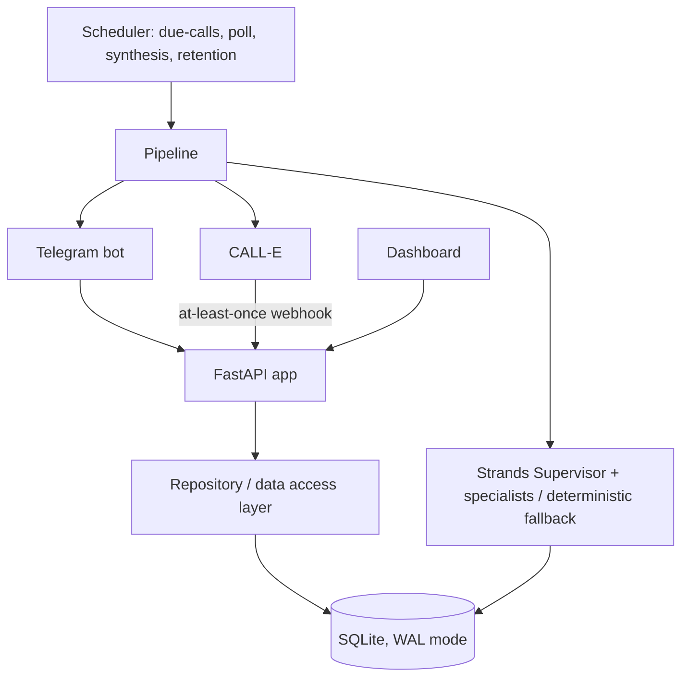

# SmartFeedback AI — Production Readiness

This document describes how the system actually works, where data lives, and
what is and is not guaranteed. It is meant to be read together with the code
and `TEST_REPORT.md`.

## 1. System architecture



Single-process, single-server deployment (`uvicorn`). The scheduler and Telegram
bot run as asyncio tasks inside the same process.

## 2. Components

| Module | Responsibility |
| --- | --- |
| `app/config.py` | settings from env/`.env` |
| `app/db.py` | SQLite connection, schema, migrations |
| `app/repository.py` | the only data access layer |
| `app/pipeline.py` | order -> call -> analyze -> persist -> notify |
| `app/calle.py` | CALL-E client wrapper + transcript extraction |
| `app/phones.py` | E.164 normalization + region validation |
| `app/analyzer.py` | deterministic feedback analyzer (fallback) |
| `app/canonical.py` | canonical problem matching (vector in SQLite) |
| `app/vector.py` | deterministic text embeddings |
| `app/trends.py` | deterministic trend/resolution classification |
| `app/evidence.py` | evidence-bound claims, deterministic verification, confidence |
| `app/policy.py` | deterministic decision gate + structured dissent |
| `app/eval_harness.py` | offline golden-transcript evaluation metrics |
| `app/agents/strands_agents.py` | Strands supervisor + specialists |
| `app/llm.py` | Bedrock + DeepSeek providers |
| `app/scheduler.py` | background jobs |
| `app/telegram_bot.py` | Telegram panel, alerts, human approval |
| `app/notify.py` | decoupled notification bridge |
| `app/logging_setup.py` | secret-redacting logging |
| `app/secrets.py` | `.env` secret writer (never echoes) |
| `app/seed.py` / `app/mock_call.py` | demo data / mock end-to-end |

## 3. Data flow

```
Telegram phone -> handle_order -> validate phone -> customer upsert -> order
   -> (sent) mark_order_sent(+delay) -> scheduler run_due_calls
   -> dispatch CALL-E call (one per order)
   -> CALL-E terminal event (webhook, deduped) or scheduler poll
   -> extract transcript -> process_call_result
   -> analyze (Strands or deterministic) -> save feedback (unique per call)
   -> canonical problem matching -> recurring detection
   -> decision (alert? insight? compensation proposal?)
   -> persist insight -> notify Telegram / approval buttons
```

## 4. Database schema

SQLite, WAL mode, `busy_timeout=30000`, `foreign_keys=ON`.

| Table | Key fields | Notes |
| --- | --- | --- |
| `businesses` | id, name, close_hour, morning_summary_hour, post_delivery_delay_minutes, timezone | single business (demo) |
| `customers` | id, business_id, phone, order_count, loyalty_status, churn_risk, do_not_call | `UNIQUE(business_id, phone)` |
| `orders` | id, customer_id, status, feedback_scheduled_at, correlation_id | created/sent/completed |
| `calls` | id, order_id (UNIQUE), customer_id, status, calle_call_id, transcript, failure_code, is_simulated, notify_completion | one per order |
| `feedbacks` | id, call_id (UNIQUE), order_id, satisfaction, sentiment, positives, priority, urgency, missing_products, transcript, raw_json | one per call |
| `canonical_problems` | id, business_id, name, count, status, vector | `UNIQUE(business_id, name)` |
| `feedback_problems` | feedback_id, canonical_problem_id, problem_text, severity | `UNIQUE(feedback_id, canonical_problem_id)` |
| `insights` | id, business_id, insight_type, title, description, priority, period_start/end, notified | daily_summary / missing_item / recurring |
| `actions` | id, business_id, action_type, status(proposed/resolved), decision, outcome | human approval |
| `cases` | id, business_id, canonical_problem_id, status, occurrence_count, severity, confidence, evidence_json, dissent_json, outcome | persistent operational case (UNIQUE business+problem) |
| `webhook_events` | event_id (PK), calle_call_id, processed_at | at-least-once dedup |
| `model_runs` | call_id, provider, model, step, fallback_occurred, latency_ms | model provenance |

Migrations are additive and idempotent (see `db._migrate`).

### Decision governance (claim → evidence → verification → confidence → decision)

The supervisor LLM only *proposes*; a deterministic gate (`app/policy.py`) decides:

```
transcript -> structured claims (evidence-bound transcript spans) -> verification
           -> confidence (evidence quality + signal + sample size + verification)
           -> decision gate (no_action / record / alert / human_approval / blocked)
           -> case upsert (cross-call recurrence) -> outcome
```

- A claim is only acted on when its referenced span exists in the transcript and
  is supported (an explicit absence/negation signal for missing items).
- Unsupported/unverifiable claims are downgraded and recorded as `dissent` — the
  system can deliberately stay silent instead of alerting on weak evidence.
- No alert and no compensation proposal is produced from unverified evidence.
- Thresholds (`MIN_ALERT_CONFIDENCE`, `RECURRING_THRESHOLD`) are configurable.

## 5. File / runtime storage

| Data | Location | Format |
| --- | --- | --- |
| database | `data/smartfeedback.db` (+ `-wal`, `-shm`) | SQLite |
| secrets | `.env` (gitignored) | text |
| example config | `.env.example` | text |
| logs | stdout (systemd/uvicorn captures) | text, secret-redacted |
| dashboard | `web/index.html` | static HTML/JS |

No raw audio is stored anywhere. No uploads, cache, or session state on disk.

## 6. Environment variables

See `.env.example`. Secrets (`TELEGRAM_BOT_TOKEN`, `CALLE_API_KEY`,
`AWS_ACCESS_KEY_ID`, `AWS_SECRET_ACCESS_KEY`, `DEEPSEEK_API_KEY`) are loaded
from `.env` and never logged.

## 7. External APIs

- **CALL-E** (`https://api.heycall-e.com`) — outbound calls, webhooks.
- **Amazon Bedrock** — agent LLM (`BEDROCK_MODEL_ID`).
- **DeepSeek** (optional) — canonicalization / NL query.
- **Telegram Bot API** — messaging.

## 8. CALL-E limitations (verified against official docs)

- **Supported regions** (docs.heycall-e.com/regions): ~40 countries including US,
  UK, DE, SG, IN, and **Turkey (+90, Turkish, "International" line type)**.
- **Temporary regional restrictions**: CALL-E notes that some destinations may be
  *temporarily restricted* due to ongoing cyberattack risk controls. A live test
  to a Turkish number was rejected with a region/language error, consistent with
  such a restriction. The system does not fake Turkey support; it validates E.164
  locally and surfaces CALL-E's clear error (`unsupported_region`/`unsupported_language`).
- **Credit consumption** for rejected (pre-acceptance) requests: **UNKNOWN / NOT
  DOCUMENTED** by CALL-E. Rejected calls are avoided where possible; no speculative
  calls are made.
- **Idempotency**: `Idempotency-Key` — reusing the same key with the same request
  returns the original call (no duplicate). Reusing a key with a *different* body
  returns `409 idempotency_conflict`. The system derives a stable key `order-{id}`.
- Webhooks are **unsigned** and **at-least-once**; dedup via `CALL-E-Event-Id`.
- Stable error codes include `insufficient_balance` (402), `rate_limit_exceeded`,
  `unsupported_region`, `unsupported_language`, `invalid_phone`, etc. The system
  maps these to actionable messages and stores `code: message` in `calls.failure_code`.

## 9. Metadata / correlation chain

Every call carries caller-owned `metadata` echoed on the call and webhook payload:

```
metadata = { order_id, correlation_id, business_id, environment, source }
```

Correlation chain (traceable forward and backward from any record):

```
CALL-E call (call_…) + provider_call_id
   ↕ calls.calle_call_id  (+ orders.correlation_id)
   ↕ calls.order_id  -> orders.customer_id  -> customers.phone
   ↕ feedbacks.call_id -> feedbacks (structured analysis)
   ↕ canonical_problems (via feedback_problems)
   ↕ insights / actions
```

## 10. Backup / recovery

- `app/backup.py` uses `sqlite3.Connection.backup()` (consistent online snapshot)
  and verifies each backup with `PRAGMA integrity_check`.
- The scheduler runs a daily backup (business-local day) when `BACKUP_DIR` is set,
  prunes to `BACKUP_KEEP`, and notifies Telegram on failure.
- Manual: `python -m app.backup --dest-dir backups` and
  `python -m app.backup --verify backups/smartfeedback-….db`.
- Restore = replace `data/smartfeedback.db` with a verified backup file.

## 9. Failure handling & idempotency

- One call per order (`calls.order_id UNIQUE`); duplicate dispatch is caught and skipped.
- One feedback per call (`feedbacks.call_id UNIQUE`); duplicate processing is caught (`IntegrityError` → no-op) and guarded by `feedback_exists`.
- Webhook events deduplicated via `webhook_events.event_id` (PK).
- CALL-E errors (timeout/4xx/5xx/network) are caught and the call is marked `failed` with a `failure_code`; no crash, no data loss.
- Telegram failure never loses feedback: the DB write happens before notification, and `notify.send_admin` swallows transport errors.
- Daily synthesis is idempotent per business-day (`daily_summary_exists`).
- SQLite concurrency: WAL + busy timeout; concurrent writers are serialized; unique indexes prevent duplicates (verified by thread-based tests).

## 10. Retention

- `RAW_TRANSCRIPT_RETENTION_DAYS` (default 90, 0 = keep forever).
- The retention job nulls `feedbacks.transcript` and `calls.transcript` (and the
  `summary` excerpt in `raw_json`) older than the cutoff, while keeping
  satisfaction, sentiment, problems, canonical links, aggregates and insights.

## 11. Backup / recovery

Automatic daily backups (see section 10) with `PRAGMA integrity_check` verification,
configurable retention (`BACKUP_KEEP`), and Telegram notification on failure.
Recovery is restoring a verified backup file.

## 12. Security

- Secrets never committed (`.env` gitignored) and never logged (redacting formatter).
- Optional `API_TOKEN` guards mutating API endpoints.
- Telegram commands (`/setup`, `/call`, `/demo`) are admin-only.
- Webhooks are unsigned by the provider; event-id dedup mitigates replay.
- SQL is parameterized (no string-built SQL from user input). `update_business_settings`
  builds column names from a fixed allow-list.
- No debug mode; no stack traces to end users (Telegram/API return messages).

## 13. Testing

See `TEST_REPORT.md`. Suite: 152 tests across 31 files covering unit,
integration, failure-injection, concurrency, idempotency, retention, trends,
prompt-injection/red-team, human approval, downstream actions, mass-data
(1000 feedbacks), and edge cases.

## 14. Known limitations

- **Single business** per deployment (`get_or_create_business` returns the first row).
- **Single server / single process**; no distributed workers or horizontal scaling.
- **CALL-E Turkey support**: not available; the demo uses simulated calls and the
  deterministic analyzer when no Bedrock credentials are present.
- **Bedrock not verified at runtime** in this environment (no AWS credentials).
  The Strands agent code is present and structurally wired, but a live Bedrock
  invocation has **not** been executed here (see TEST_REPORT).
- **Human-approval** records decisions only; the actual offer delivery
  (calling the customer back with the offer) is not yet automated.
- **Timezone**: scheduling uses `BUSINESS_TIMEZONE` (default UTC); DST handled by
  `zoneinfo`. `close_hour`/`morning_summary_hour` are interpreted in that timezone.
- **Webhook endpoint** has no provider signature (CALL-E sends none); trust is
  mitigated by event-id dedup and optional reverse-proxy/IP allow-listing.
