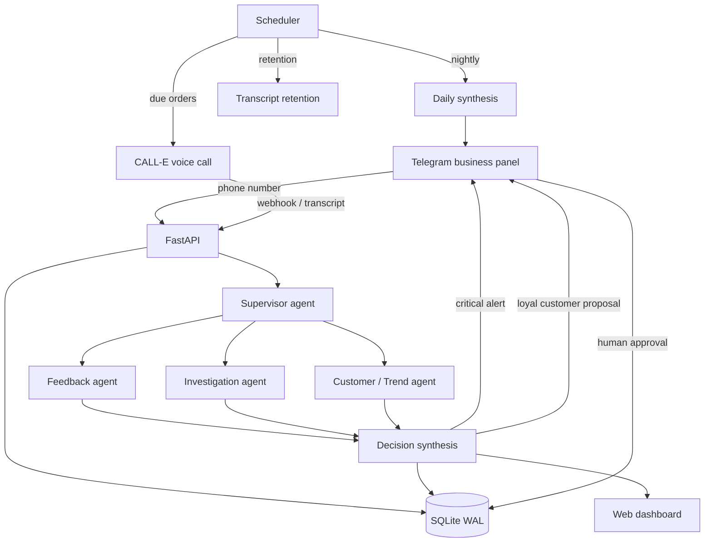

# SmartFeedback AI

> Turn customer **voice** into **actionable business intelligence**.

SmartFeedback AI calls customers after a completed order/service, turns the
conversation into text, analyzes it with a **Strands agent** system, and
produces evidence-backed, prioritized actions for the business — only pinging
the owner's Telegram when something actually needs attention.

**Strands Agents SDK** is the agent framework at the center. The demo runs it on
**DeepSeek** (OpenAI-compatible, `LLM_PROVIDER=deepseek`); **Amazon Bedrock**
(`LLM_PROVIDER=bedrock`) plugs into the same model provider socket via the
Converse adapter for Nova/Llama, and falls back to DeepSeek on failure.

## What it does

1. Business sends a customer phone number via Telegram (two options only: *order created* / *order sent*).
2. After delivery, the system schedules **one** CALL-E phone call (`POST_DELIVERY_DELAY_MINUTES`, default 30).
3. A short, fixed opening is spoken; the customer speaks freely (raw audio is never stored).
4. Speech is transcribed and analyzed by the agent system.
5. Structured feedback, recurring problems, trends, loyalty and churn signals are persisted.
6. Critical events (e.g. a missing item) trigger an immediate Telegram alert; the rest is summarized in a nightly synthesis delivered as a morning summary.
7. The business can ask natural-language questions over its own data.
8. For loyal customers with a negative experience, the system **proposes** a compensation offer; the business approves (25%/50%/75%/custom) via Telegram. The system **never** applies discounts/refunds automatically.

## Architecture



### Agent structure (Strands Agents SDK)

- **Feedback agent** — understands the transcript into structured output
  (satisfaction, sentiment, positives, problems, priority, missing items). No
  tools; a direct LLM transformation of the transcript.
- **Investigation agent** — queries customer history and recent canonical
  problems via 3 read-only tools (`get_customer_history`, `list_recent_problems`,
  `list_recent_feedback`).
- **Customer/Trend agent** — loyalty, churn and problem-trend signals, using the
  same 3 read-only tools.
- **Supervisor agent** — tool-less; only reconciles the three specialists'
  findings into a proposal `Decision` (including a proposed alert flag). It
  never calls a tool and never sends anything itself: the actual alert/record/
  human-approval/blocked outcome is decided by the deterministic policy gate
  (`app/policy.py`), and the real Telegram send happens in `app/pipeline.py`.

`app/agents/tools.py` defines a richer 7-tool set (including a Telegram-send
tool and a DNC-list-mutation tool) intended for a more autonomous agent loop,
but it is **not currently wired into any agent** — only its own unit test
(`tests/test_tools.py`) exercises it directly. Treat it as a prepared-but-inactive
extension point, not part of the live decision path.

Deterministic aggregation (counts, thresholds, date comparisons, recurring
problem tracking, trend classification) is done in Python/SQL; the LLM is used
for understanding, classification and explanation. Canonical problem matching
uses a small deterministic vector store kept in SQLite (no Pinecone), optionally
refined by the LLM.

### Evidence, verification & deterministic governance

The LLM (supervisor) only **proposes** an outcome. A deterministic policy layer
decides what actually happens:

```
transcript -> structured claims (evidence-bound spans) -> deterministic verification
           -> confidence -> decision gate (no_action / record / alert / human_approval / blocked)
           -> persistent case state -> outcome
```

- **Claims** carry the exact transcript span backing each problem / missing item.
- **Verification** checks (deterministically) that the span exists and is
  supported; unsupported/unverifiable claims are rejected and downgraded.
- **Confidence** is computed from evidence quality, signal strength, sample size
  and verification rate — never an opaque LLM number.
- **Decision gate** (`app/policy.py`) is *risk-adaptive*: it enforces that no
  alert and no compensation is produced from unverified evidence, escalates
  recurring high-severity/high-impact defects, and routes high-impact-but-
  uncertain cases to human review. Disagreement is recorded as structured
  `dissent`, not silently dropped.
- **Business impact score** (`app/impact.py`) is deterministic (recurrence ×
  severity × affected customers × trend × recency) — sentiment is not the metric.
- **Trend engine** reports trend confidence and `INSUFFICIENT_DATA` instead of
  fabricating a "rising" trend from two samples.
- **Cases** (`app/cases` table) fold recurring evidence about the same canonical
  problem into one persistent operational case across calls, with impact, trend
  and affected-customer tracking.
- **Model provenance** (`app/model_runs` table) records provider, model, fallback
  and latency for every important LLM decision.
- **Idempotency & hardening**: outbound alarms are deduplicated by idempotency
  key; human approvals expire and reject duplicate callbacks.
- A deterministic **evaluation harness** (`app/eval_harness.py`) runs golden +
  adversarial transcripts offline and reports sentiment accuracy, alert
  precision/recall, missing-item and DNC metrics, plus a confidence-calibration
  breakdown.

### Adaptive contextual calling (closed loop)

Before a call is placed, the system builds a **safe** pre-call context from the
customer's own *verified, structured* case history (canonical problem names
only — never raw transcripts, never PII, never other customers' data). If a
customer previously reported a confirmed issue, the next CALL-E call asks a
natural follow-up about it. Low-confidence or unresolved-free history produces
no context; DNC is respected before any context is ever built.

```
voice -> evidence -> persistent case -> recurring problem -> next-call context -> smarter conversation
```

### Why not one LLM call?

Because a single LLM call has none of the system behaviors that make the output
trustworthy and auditable:

- **specialist separation** — feedback, investigation and trend extract different
  operational signals (the LLM *proposes*, it does not decide);
- **evidence binding** — every claim references the transcript span that backs it;
- **independent verification** — claims are checked against the transcript and
  rejected when unsupported;
- **persistent case state** — recurrence is a first-class, cross-call concept;
- **deterministic governance** — a policy gate (not the LLM) decides
  no_action / record / alert / human approval / blocked;
- **human authority** — consequential (money-related) actions always require approval;
- **provenance + replay** — which model decided what, and why, is reproducible.

## Stack

- **CALL-E** — voice calls
- **Strands Agents SDK** — agent intelligence (DeepSeek in the demo; Bedrock pluggable)
- **DeepSeek** — model provider (demo default)
- **Amazon Bedrock** — alternative model provider (same socket)
- **Python / FastAPI** — backend
- **SQLite (WAL)** — storage
- **python-telegram-bot** — business panel + alerts + human approval
- **Web dashboard** — visual overview

## Quick start

```bash
python3 -m venv .venv
source .venv/bin/activate
pip install -r requirements.txt

cp .env.example .env        # then fill in secrets (see below)
python -m app.seed          # optional demo data

uvicorn app.main:app --host 0.0.0.0 --port 8000
```

Open http://localhost:8000 for the dashboard and http://localhost:8000/health
for a health check. Run tests with `pytest -q`.

## Configuration

Set these in `.env` (never commit it; never log secrets):

| Variable | Purpose |
| --- | --- |
| `TELEGRAM_BOT_TOKEN` | Telegram bot token |
| `TELEGRAM_ADMIN_CHAT_ID` | set automatically by first `/start` |
| `CALLE_API_KEY` | CALL-E API key |
| `CALLE_WEBHOOK_BASE_URL` | public HTTPS base URL for CALL-E webhooks |
| `AWS_ACCESS_KEY_ID` / `AWS_SECRET_ACCESS_KEY` | Bedrock credentials |
| `AWS_REGION` / `BEDROCK_MODEL_ID` | Bedrock region & model (Nova/Llama via Converse) |
| `DEEPSEEK_API_KEY` | DeepSeek model (demo default) |
| `DEEPSEEK_BASE_URL` / `DEEPSEEK_MODEL` | DeepSeek endpoint & model id |
| `LLM_PROVIDER` | agent model provider: `deepseek` (default) or `bedrock` |
| `POST_DELIVERY_DELAY_MINUTES` | feedback-call delay after delivery (default 30) |
| `BUSINESS_CLOSE_HOUR` / `MORNING_SUMMARY_HOUR` | nightly synthesis timing |
| `BUSINESS_TIMEZONE` | IANA timezone for scheduling (default UTC) |
| `RAW_TRANSCRIPT_RETENTION_DAYS` | raw transcript retention (default 90, 0 = forever) |
| `SUPPORTED_CALL_REGIONS` | optional comma-separated ISO-3166 override (empty = rely on CALL-E) |
| `ENVIRONMENT` | deployment tag carried in CALL-E call metadata (default dev) |
| `API_TOKEN` | optional shared token guarding mutating API endpoints |
| `BACKUP_DIR` / `BACKUP_KEEP` | automatic daily DB backup dir / retention count |
| `LOG_FILE` | optional rotating log file (empty = stdout / systemd journald) |

### Telegram setup flow

The first user who sends `/start` becomes the admin (their chat id is persisted
to `.env`). Commands:

- `/start` — register as admin / overview
- `/setup` — enter missing API keys (values are written to `.env`, never echoed)
- `/health` — system status
- `/demo` — run a simulated analysis (clearly marked as simulated)
- `/call <phone>` — trigger an immediate real CALL-E call (admin only)

Send a phone number to create an order, then choose **Order created** or
**Order sent**. Any other text is treated as a question over the stored data
(e.g. *"what was our biggest problem this week?"*).

## CALL-E support & limitations

- **Supported regions**: CALL-E publishes a coverage table (docs.heycall-e.com/regions)
  covering ~40 countries including the US, UK, Germany, Singapore, India **and
  Turkey (+90, Turkish)**. Turkey is listed with an "International" line type
  (primarily for testing; a local line requires contacting CALL-E).
- **Temporary regional restrictions**: CALL-E states that some destinations may
  be *temporarily restricted* due to ongoing cyberattack risk controls. A live
  test to a Turkish number was rejected with a region/language error, consistent
  with such a temporary restriction. The system does **not** fake Turkey support:
  it validates E.164 format locally, then relies on CALL-E as the authoritative
  region/language gate and surfaces the provider's clear error
  (`unsupported_region` / `unsupported_language`) to the business.
- The exact supported-region list and any restrictions are the provider's; the
  optional `SUPPORTED_CALL_REGIONS` override lets you gate locally when needed.
- **Credit consumption** for rejected (pre-acceptance) requests is not
  documented by CALL-E; treat it as UNKNOWN and avoid unnecessary calls.
- CALL-E webhooks are **unsigned** and delivered **at-least-once**; the system
  deduplicates on the `CALL-E-Event-Id` header before performing side effects.
- Dashboard ve okuma API'leri (`GET /`, `/api/*`) şu an kimlik doğrulama
  gerektirmiyor — sadece POST endpoint'leri `API_TOKEN` ile korunuyor. Üretim
  ortamı için bu, GET uçlarına da token koruması eklenerek kapatılmalı.
- Raw audio is never stored; only the transcript and structured analysis are kept.

## Operational guarantees

- One feedback call per order (unique constraint); no retry on no-answer.
- A customer who says "don't call me" is marked `do_not_call` and never called again.
- Idempotent processing: duplicate webhooks, duplicate call results and concurrent
  workers cannot create duplicate feedback or duplicate calls.
- Raw transcript retention is configurable; structured analysis, aggregated stats,
  problem IDs, trends and action outcomes are retained independently.
- Automatic daily database backups (verified with `PRAGMA integrity_check`) with
  configurable retention; see `BACKUP_DIR` / `BACKUP_KEEP`.
- No automatic discounts/refunds — the system only proposes actions, and applies
  them only after explicit human approval (which is recorded, never auto-executed).
- No alert or compensation is produced from unverified evidence: a deterministic
  decision gate downgrades/records unsupported claims instead of acting on them.
- Customer transcripts are treated as untrusted data (isolated from agent
  instructions); "do not call" requests are detected from an explicit phrase only.
- Secrets are redacted from all logs (including exception tracebacks).
- Dependency-level `/health` (database, CALL-E, AWS/Bedrock, Telegram) plus a
  one-time Telegram notice at startup if a critical dependency is missing.

## API

| Method | Path | Auth | Purpose |
| --- | --- | --- | --- |
| GET | `/health` | — | health |
| GET | `/` | — | dashboard |
| GET | `/api/summary` | — | dashboard data |
| GET | `/api/problems` | — | canonical problems |
| GET | `/api/insights` | — | insights |
| GET | `/api/feedbacks` | — | feedback records |
| POST | `/api/orders` | token* | create order |
| POST | `/api/test-call` | token* | immediate real call |
| POST | `/api/mock-call` | token* | simulated call (no real call) |
| POST | `/api/demo` | token* | simulated analysis |
| GET | `/api/calls/{id}` | — | call status |
| POST | `/api/webhooks/calle` | CALL-E event | voice webhook |

`token*` = guarded when `API_TOKEN` is set (via `X-API-Token` header).

## Data model

`businesses` → `customers` → `orders` → `calls` → `feedbacks` → `canonical_problems`
(+ `feedback_problems` join) → `insights` → `actions` (human approval) +
`cases` (persistent case state) + `webhook_events` (dedup) + `model_runs`
(provenance). See `PRODUCTION_READINESS.md` for the full schema and
data-flow.

## Genişletilebilirlik

Mevcut mimari (sipariş tetikleyici → CALL-E araması → Strands analizi →
deterministik karar → Telegram bildirimi) siparişe özgü değildir: gerçek iş
mantığı, "bir tetikleyici olay bir sesli görüşme başlatır, görüşme metni
kanıt-doğrulama-güven zincirinden geçer, deterministik bir politika katmanı
karar verir, insan sadece parasal sonuçları onaylar" akışıdır. `BUSINESS_TYPE`
ayarı (`app/config.py`, varsayılan `order_fulfillment`) bu farkı şimdiden
kod düzeyinde adlandırıyor; ileride `appointment_reminder` (randevu hatırlatma
+ katılım teyidi) veya `subscription_renewal` (abonelik yenileme + itiraz
toplama) gibi değerler eklendiğinde, değişmesi gereken tek şey *hangi tabloya
göre "tetiklenmeye hazır" kayıtların sorgulandığı* (`list_orders_due_for_feedback`
benzeri bir fonksiyon) ve CALL-E'ye gönderilen görev metnidir — kanıt
çıkarma (`evidence.py`), karar kapısı (`policy.py`), iş-etkisi skoru
(`impact.py`) ve Telegram bildirim/onay katmanı hiç dokunulmadan aynı kalır.

## Testing

```bash
pytest -q
```

The suite covers unit, integration, failure-injection, concurrency,
idempotency, retention, trend and mass-data (1000 feedbacks) scenarios.

## License

MIT — see [LICENSE](LICENSE).
